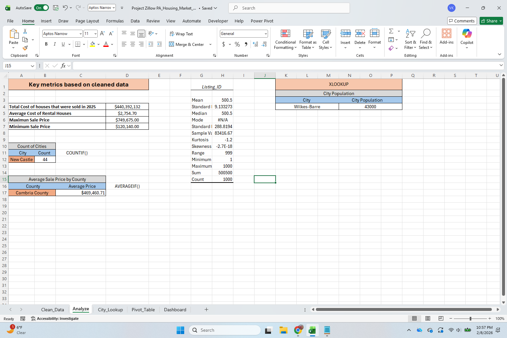
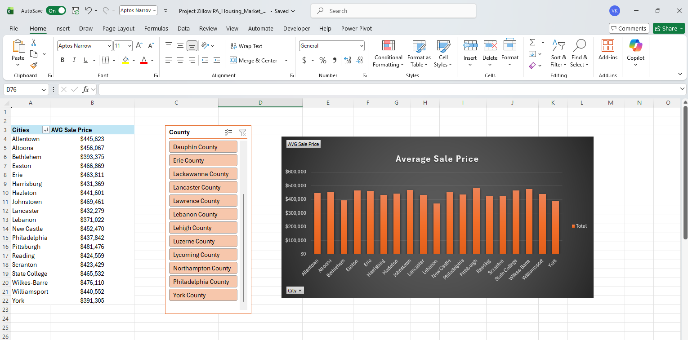
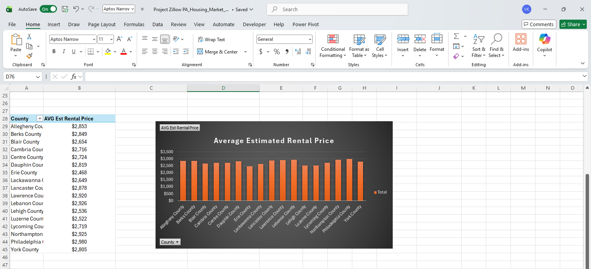
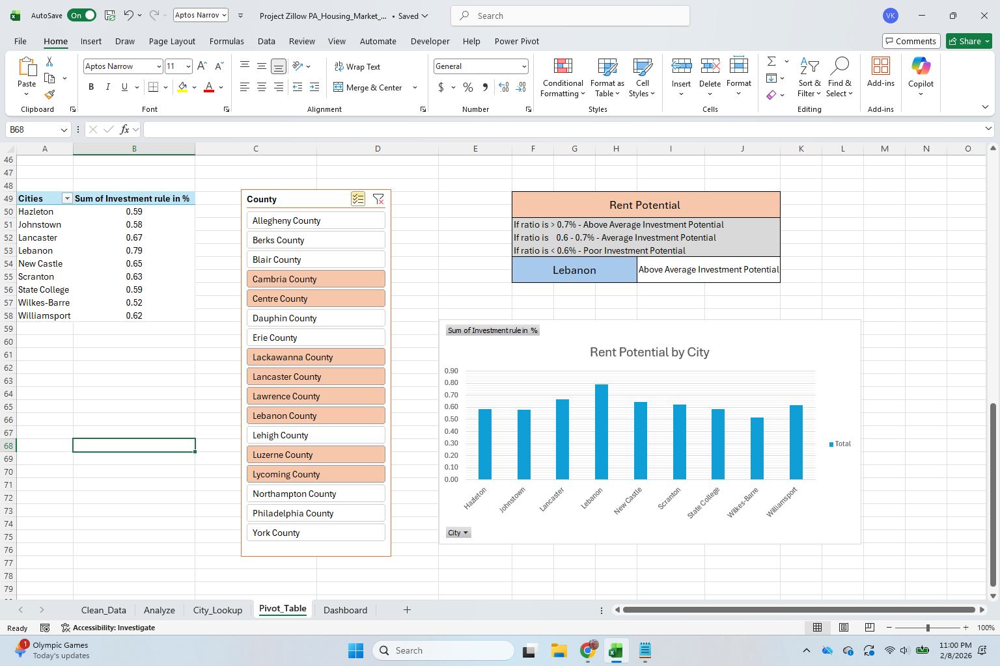
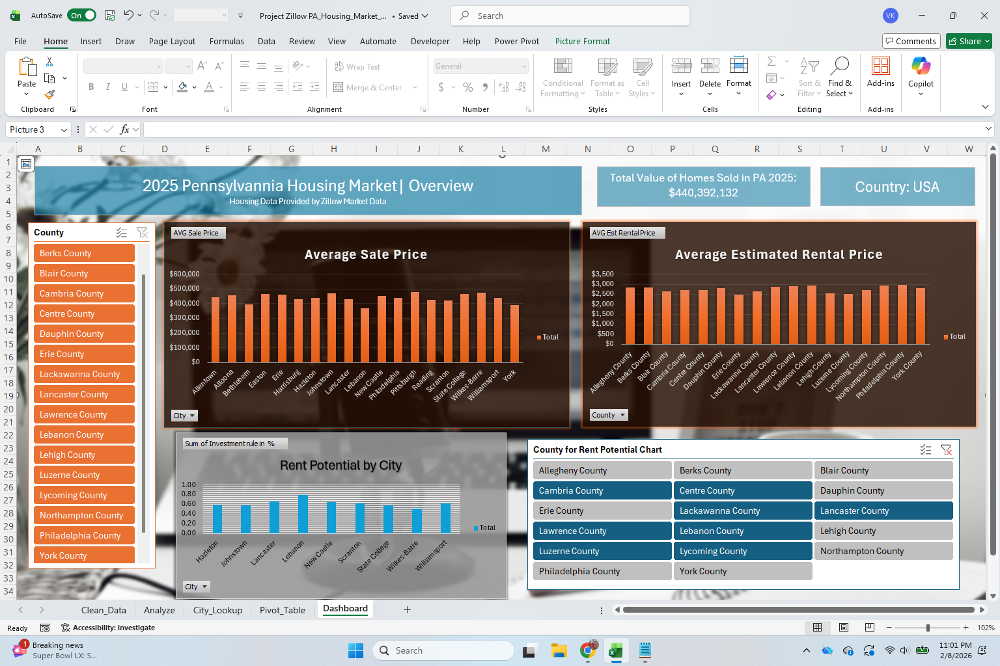

# Portfolio Projects 
## Excel - 2025 Pennsylvania Housing Market
*Kindly download these Excel files from this repository and view them in Microsoft Excel*
#### Business problem: Which Pennsylvania cities offer the best real estate investment opportunities in 2025 based on price growth and rent yield? 
- **Clean_Data Sheet**  
Organized the dataset into a table with filters, removed duplicate records and blank values, and applied conditional formatting to improve data clarity and accuracy.

- **Analyze Sheet**  
Calculated important metrics such as the total value of sold homes, average rental prices, and minimum and maximum sale prices. Used COUNTIF() to count sold homes by city, AVERAGEIF() to calculate average sale price by county, and XLOOKUP() to pull city population data. Applied descriptive statistics to analyze price distribution and market patterns.

- **City_Lookup**  
Used INDEX/MATCH() to connect and add the city column to the second table. Applied XLOOKUP() to pull price data into the second table.

- **Pivot_Tables**  
Created Pivot Tables, charts, and slicers to analyze pricing trends by city & county. Applied an investment rule (the 1% rental rule) to evaluate rent potential across cities. Based on the guideline that gross monthly rent should be at least 1% of the purchase price, created a Rent Potential calculation by city using XLOOKUP() to see how closely properties meet this benchmark.

- **Dashboard**  
The dashboard demonstrates that evaluating multiple factors together — including rental yield, tax burden, price growth, and market activity — provides a more accurate assessment of investment potential than analyzing price alone.

## Approaches explored but replaced 
**VLOOKUP → replaced with XLOOKUP** for better flexibility and cleaner syntax.

**Using only filters for nulls → added COUNTBLANK + conditional formatting** to make issues visible immediately.

## Business recommendations
Investors should prioritize cities where rental income is high relative to purchase price to improve steady returns. 
Prioritize cities with bigger populations, as they are more likely to support long-term rental demand.

#### This project demonstrates how Excel can be used not only for data cleaning and reporting but also as a financial modeling and decision-support tool for strategic real estate investment planning.
